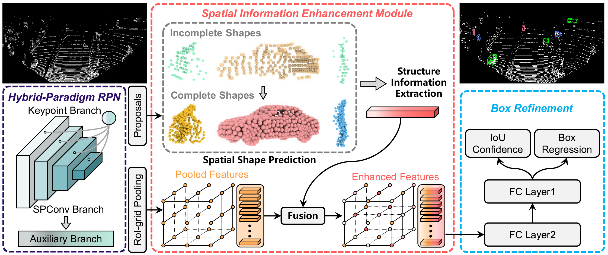

# SIENet: Spatial Information Enhancement Network

This is the official implementation of  ***SIENet*** (Pattern Recognition, 2022), a 2-stage detector leveraging spatial structure information for robust and accurate 3D detection from point clouds. For more details, please refer to:

**Spatial information enhancement network for 3D object detection from point cloud**

[Ziyu Li](https://github.com/Liz66666), Yuncong Yao, Zhibin Quan, Jin Xie, Wankou Yang

**[[Paper](https://www.sciencedirect.com/science/article/pii/S0031320322001650)]**

## Introduction

<p align="center">
  
</p>

LiDAR-based 3D object detection pushes forward an immense influence on autonomous vehicles. Due to the limitation of the intrinsic properties of LiDAR, fewer points are collected at the objects farther away from ego-vehicle. This imbalanced density of point clouds degrades the detection accuracy. To address the challenge, we propose the SIENet (Spatial Information Enhancement Network) to recover the dense shapes and extract spatial information for robust and accurate 3D detection from point clouds. SIENet has two key components:

- Spatial Information Enhancement (SIE) module. We devise the SIE module to predict the spatial shapes of foreground points within proposals, and extract the structure information to learn representative features for further box refinement.
- Hybrid-Paradigm Region Proposal Network (HP-RPN). This sub-network includes multiple branches to learn discriminate features and generate accurate proposals for the SIE module.

**Important Notes**: The training process of SIENet requires 4 NVIDIA TITAN XP GPUs (total batch size 8), which means a minimum GPU memory of 48 (4*12) GB is needed for reproducing the results. If your GPU resource is less than 48 GB, you can decrease the batch size in the training command, but this may harm the final performance. The 3D/BEV AP fluctuates at different epochs, thus it is advised to evaluate all saved checkpoints. 

*The code is mainly based on [OpenPCDet](https://github.com/open-mmlab/OpenPCDet).

## Requirements

We have tested this project with the following environments:

- ubuntu 16.04/18.04
- PyTorch 1.2.0
- Spconv v1.0
- OpenPCDet v0.2.0

## Installation

a. Clone this repository.

```
git clone git@github.com:Liz66666/SIENet.git
```

b. Install some dependent libraries as follows:

- Install the dependent libraries of python:

```
pip install -r requirements.txt
```

- Install the SparseConv library, we use the implementation from [`[spconv]`](https://github.com/traveller59/spconv). Please note that we recommend installing the `spconv v1.0` with ([commit 8da6f96](https://github.com/traveller59/spconv/tree/8da6f967fb9a054d8870c3515b1b44eca2103634)) instead of the latest one.

c. Compile CUDA operators of `pcdet` by running the following command:

```
python setup.py develop
```

d. Prepare the KITTI dataset according to the  [`[guidance doc]`](https://github.com/open-mmlab/OpenPCDet/blob/master/docs/GETTING_STARTED.md) of OpenPCDet.

## Training

You could optionally add extra command line parameters to specify your preferred parameters. The performance of SIENet is quite unstable on KITTI. If you cannot reproduce the results, remember to run it multiple times.

- Train with a single GPU:

```
python train.py --cfg_file ${CONFIG_FILE} --batch_size ${BATCH_SIZE} 
```

- Train with multiple GPUs:

```
bash scripts/dist_train.sh ${NUM_GPUS} --cfg_file ${CONFIG_FILE} --batch_size ${BATCH_SIZE} 
```

## Evaluation

- Test with a pretrained model:

```
python test.py --cfg_file ${CONFIG_FILE} --batch_size ${BATCH_SIZE} --ckpt ${CKPT_PATH}
```

- Test with a series of models saved in a folder:

```
python test.py --cfg_file ${CONFIG_FILE} --batch_size ${BATCH_SIZE} --ckpt_dir ${CKPTDIR_PATH} --eval_all
```

- To test with multiple GPUs:

```
bash scripts/dist_test.sh ${NUM_GPUS} --cfg_file ${CONFIG_FILE} --batch_size ${BATCH_SIZE} --ckpt ${CKPT_PATH}
```

## License

`SIENet` is released under the [Apache 2.0 license](LICENSE).

## Acknowledgment

Thanks for the works below, this project will not be possible without these excellent codebases. 

* [OpenPCDet](https://github.com/open-mmlab/OpenPCDet)
* [SA-SSD](https://github.com/skyhehe123/SA-SSD)
* [PCN](https://github.com/wentaoyuan/pcn)

* [Deformable PV-RCNN](https://github.com/AutoVision-cloud/Deformable-PV-RCNN)

## Citation

If you find this project useful in your research, please consider citing:

```
@article{li2022spatial,
  title={Spatial Information Enhancement Network for 3D Object Detection from Point Cloud},
  author={Li, Ziyu and Yao, Yuncong and Quan, Zhibin and Xie, Jin and Yang, Wankou},
  journal={Pattern Recognition},
  pages={108684},
  year={2022},
  publisher={Elsevier}
}
```

